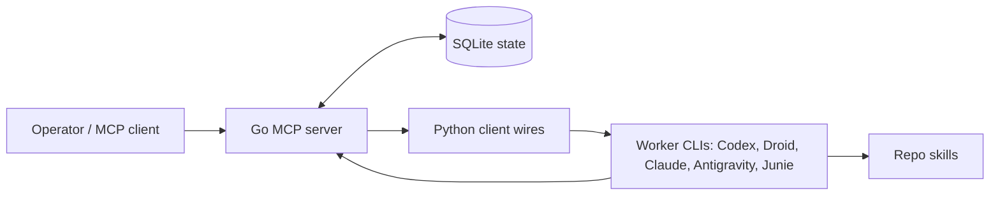

# Fixer MCP

Fixer MCP is a local-first control plane for durable, reviewable, resumable multi-agent coding work.

It exists for teams and solo operators who want agent runs to leave behind structured state: tasks, role boundaries, project canon, handoffs, tool assignment, progress logs, review decisions, and recovery handles. The point is not to make workers magically correct. The point is to make delegation inspectable and restartable.

## Roles

- Fixer: plans work, owns scope, routes sessions, and reviews before acceptance.
- Netrunner: executes one scoped task, changes code, runs checks, and reports evidence.
- Overseer: coordinates across projects and routes work to the right Fixer.

## Architecture



The Go MCP server owns durable orchestration state. The Python client wires turn that state into role launches and worker resumes. SQLite is the local source of truth. Skills are shipped as product behavior, not as private notes.

## Quick Start

Prerequisites:

- Go 1.25.4 or newer
- Python 3.12 or newer
- Node.js for the bridge and Docker smoke flows
- Codex CLI authenticated if you want Codex-backed worker launches

Install and verify the repository-native launcher and MCP server:

```bash
make install-verify
```

See `AGENTS_INSTALLATION.md` for Ubuntu/macOS prerequisites, PATH handling, updates, and explicit acceptance criteria. The installer does not edit shell startup files.

Start with one project by launching the Fixer role from that project's root. The launcher creates the project record automatically when the cwd is new:

```bash
fixer --role fixer
```

## Documentation Map

- `fixer_mcp/README.md`: MCP server details.
- `client_wires/README.md`: launcher and worker wiring.
- `.agents/skills/`: canonical role workflows used by Fixer, Netrunner, and Overseer.
- `docs/README.md`: public docs index.
- `docs/docker-smoke.md`: clean smoke and bootstrap E2E notes.
- `AGENTS_INSTALLATION.md`: receiving-agent installation and verification contract.
- `docker/`: validation containers and scripts.

## Validation

```bash
python3 -m unittest discover -s client_wires/tests
cd fixer_mcp && go build ./... && env -u FIXER_DB_PATH -u FIXER_MCP_LOCKED_ROLE -u FIXER_MCP_DEFAULT_ROLE -u FIXER_MCP_DEFAULT_CWD -u FIXER_MCP_AUTO_AUTH -u FIXER_MCP_TOOL_PROFILE go test ./...
make docker-smoke
```

`docker-smoke` is the deterministic clean check used in CI. `docker-bootstrap-e2e` is an optional manual end-to-end path that depends on Docker, network access, and authenticated Codex CLI state.

## DeepSeek in Codex

Fixer can launch interactive Codex sessions and Netrunner wave workers with
DeepSeek V4 Flash through either OpenCode Go or OpenRouter. Put the applicable
key in `~/.codex/llm.env`:

```dotenv
OPENCODE_GO_API_KEY=your-opencode-go-key
OPENROUTER_API_KEY=your-openrouter-key
```

Then select `opencode-go/deepseek-v4-flash` or
`deepseek/deepseek-v4-flash-0731` as the Codex model. The launcher supplies the
provider endpoint and bundled model metadata automatically; no manual edits to
`~/.codex/config.toml` or `~/.codex/models.json` are required.

## Current State

Fixer MCP is local-first and designed for a single operator. The primary interface is terminal/TUI oriented, with a desktop workspace under active development. The public repo intentionally avoids cloud coordination claims, auto-merge claims, and unattended production promises.

## Contributing

Useful contributions are concrete: clearer docs, tighter smoke tests, safer role boundaries, better import/export hygiene, and adapters for worker CLIs that preserve reviewability. Keep changes small enough to review and include the commands you ran.
